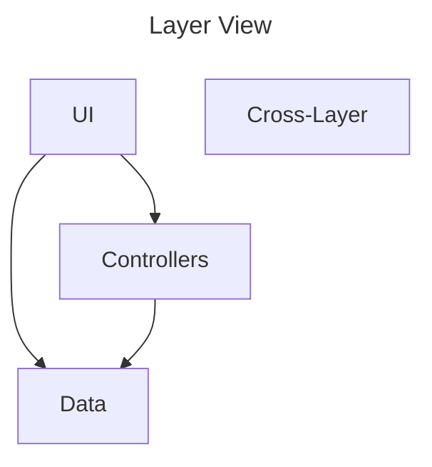
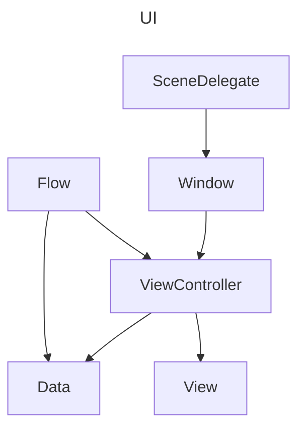
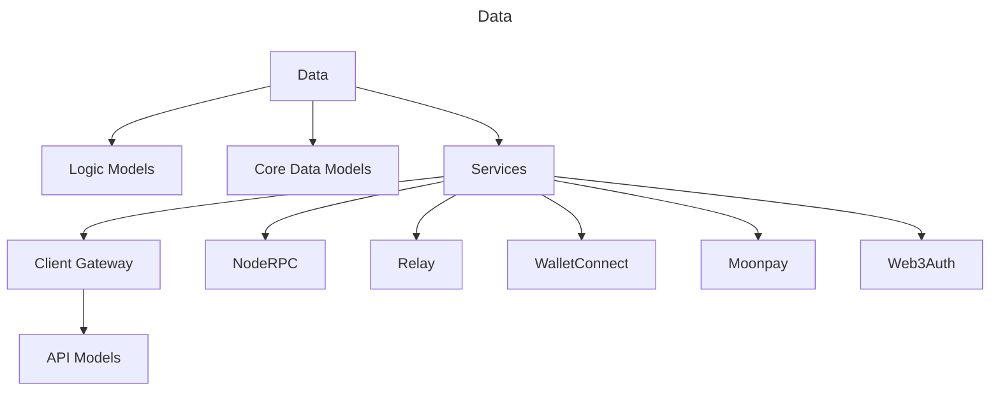
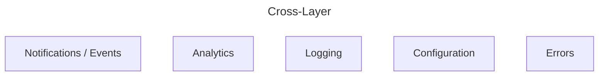
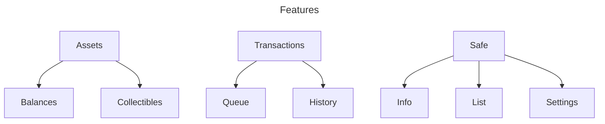
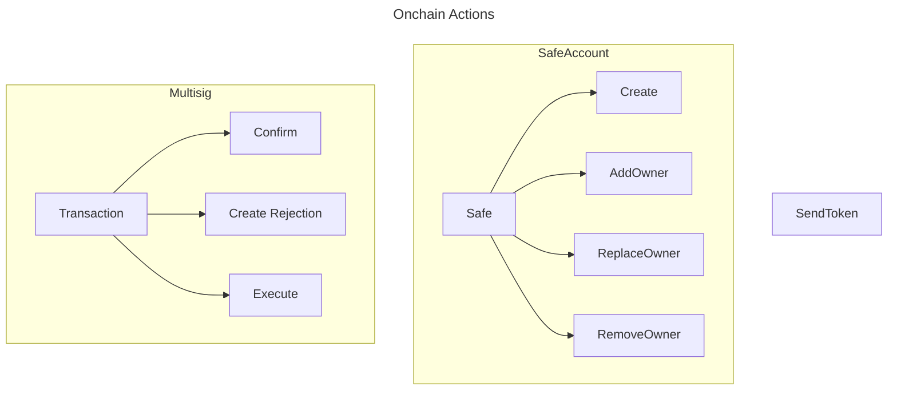
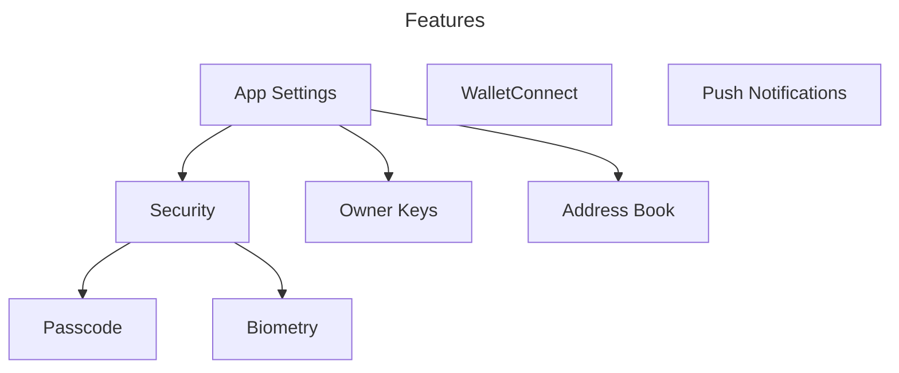
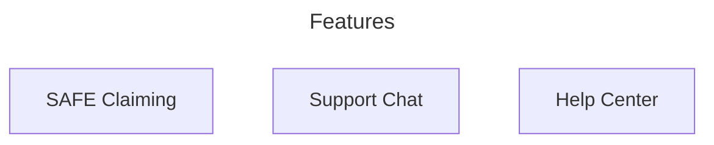
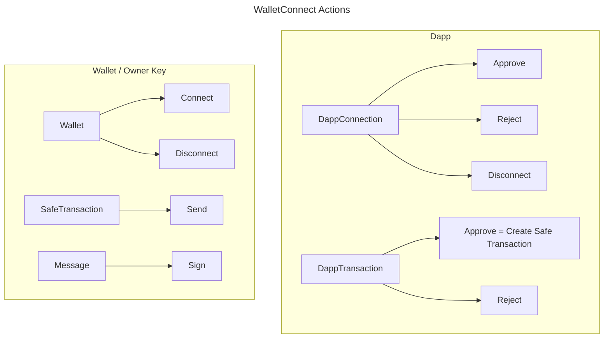

# Application

This doc explains high-level app design with a structural and functional view. 

## Structural View

`UI` implements everything related to interaction with the user: screens, animations, navigation between the screens.

`Controllers` implement processes and business logic functionality of the app, uses `Data` layer's objects.

`Data` implements access to the persistence, secure storage, as well as API models for various remote services. 

### UI

`Flow` implements navigation logic between different screens. It connects `ViewController`s together and passes data around them. 

`ViewController` implements single screen logic using `View`s as components and data provided from outside (usually a `Flow` or another `ViewController`). 

Both `Flow`s and `ViewController`s can use `Data` layer to implement conditional logic in the interface.

### Data

`Data` provides types and APIs to work with them. Much of the application deals with network services.

Persistence implemented with `CoreData` models.

In some areas, the `CoreData` are mirroring or extending the API models to persist that data between app launches. 

### Cross-Layer

`Cross-layer` objects implement utilities used throughout other layers. 

`Notification`s are used to post interesting events. `UI` can observe them and reload the data.

`Analytics` includes logging events and non-fatal errors with `Firebase`.

Firebase also provides crash-reporting via `Crashlytics` feature.

`Logging` implements multi-stage logging system.

`Configuration` includes build-time configuration via `.xcconfig` files, `Info.plist` and code-level feature flags. It also includes `Firebase` remote config.

`Errors` implement standard data type for user-facing errors.

## Functional View

The app allows to load or create Safe accounts and view their assets and transactions, as well as create and execute new transactions.

The supported transaction functions are in 3 areas: general transaction confirmation functionality, safe-related transactions that change multisig settings, and transactions to send out tokens.

Supporting functionality allows to set up a `Passcode` to restrict access to the app, add `Owner Keys` that would be used to interact with safe accounts and receive `Push Notifications` about Safe transactions.

`Address Book` allows for better readability of transaction data in the interface. 

Useres can use `Chat with us` feature implemented via Intercom to talk with a human.

`WalletConnect` is used to receive incoming transaction requests from the external apps (browser or native dapps).
It is also used to connect to the external wallets in order to access functions of private keys there: sign a message or send a transaction.
