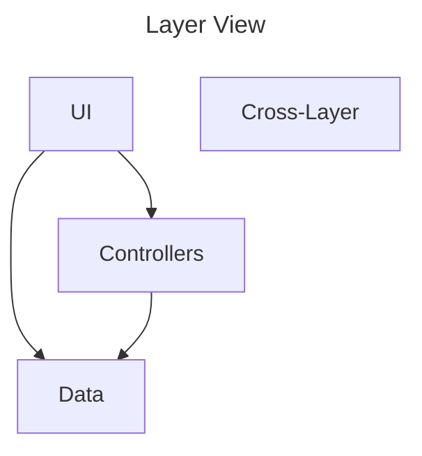
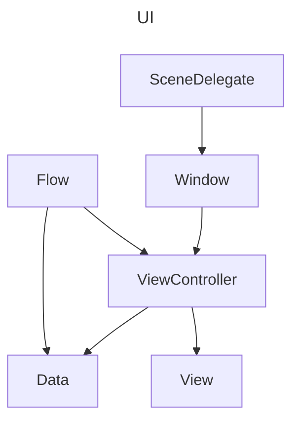
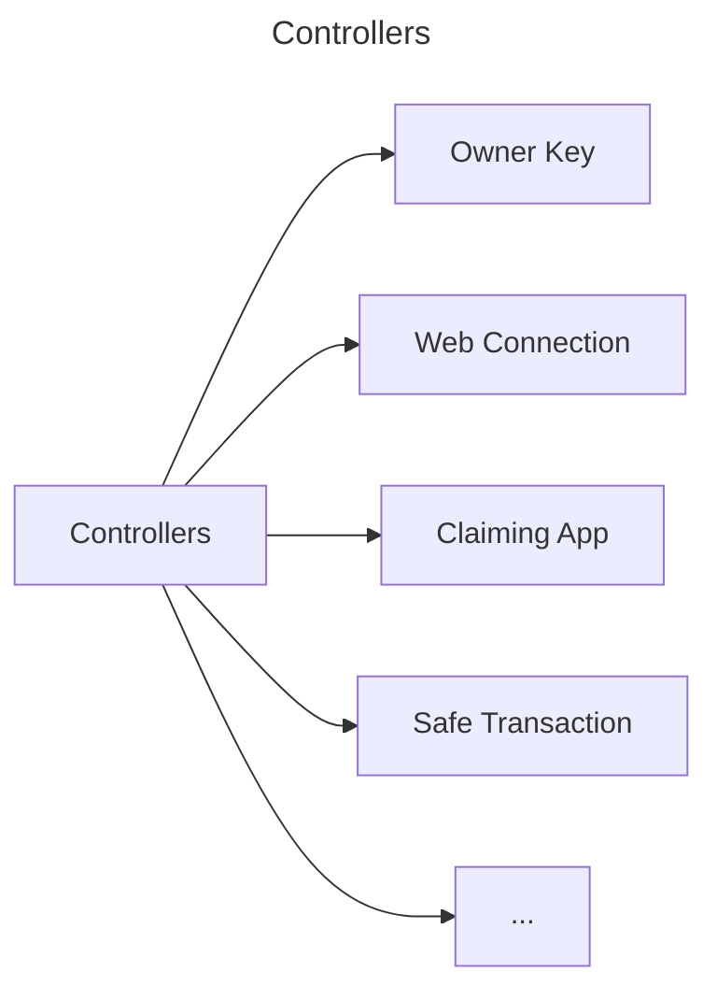
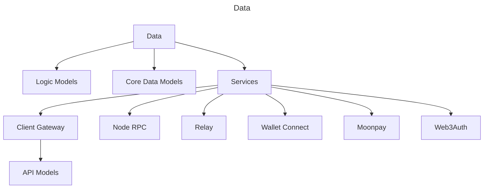
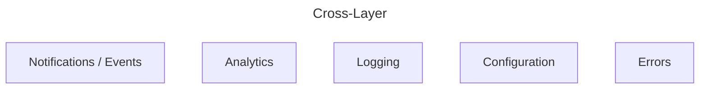

# Application

This doc explains high-level app design with a structural and functional view. 

## Structural View

Arrows represent "uses" relationship. 

Further diagrams detail each of the components. 

You can click on the nodes in this diagram.

- `UI` implements everything related to interaction with the user: screens, animations, navigation between the screens.

- `Controllers` implement some business logic, uses `Data` layer's objects.

- `Data` implements access to the persistence, secure storage, as well as API models for various remote services. 

### UI

UI layer
- `SceneDelegate` and `Window` are part of the UIKit.

- A `Flow` implements navigation logic between different screens. It connects `ViewController`s together and passes data around them. 

- A `ViewController` implements single screen logic using `View`s as components and data provided from outside (usually a `Flow` or another `ViewController`). 

- Both `Flow`s and `ViewController`s can use `Data` layer to implement conditional logic in the interface.

### Controllers

Here are some of the example logic implemented in the controllers layer.

Arrows represent "kind of" relationship.

The controllers are different from the `ViewController`s - unlike the connectors between views and models, they help implementing logic that is either compilcated or takes time or multiple steps to complete.

That being said, in many instances the data arrives directly to a `ViewController` because that's simpler.

### Data

`Data` provides types and APIs to work with them. Much of the application deals with network services.

Arrows below represent "contains" or "kind of" relationship.

Data
- `Logic Models` - data types used in the controllers or UI
- `Core Data Models` - data types for the persistence. All of the types are defined in the `Model.xcdatamodel` file.
- `Services` - remote api clients
    - `Client Gateway` - [Safe wallet API](https://github.com/safe-global/safe-client-gateway)
    - `Node RPC` - implements Ethereum RPC API
    - `Relay` - implements the transaction relay
    - `Wallet Connect` - implements connectivity to and from apps and wallets
    - `Moonpay` - onramping provider.
    - `Web3Auth` - single-click authentication to connect an owner key

Unfortunately, current project organization is out of place, so you might have difficulty finding the files named by the parts above.

### Cross-Layer

`Cross-layer` objects implement utilities used throughout other layers. 

- `Notification`s are used to post interesting events. `UI` can observe them and reload the data.

- `Analytics` includes logging events and non-fatal errors with `Firebase`.
Firebase also provides crash-reporting via `Crashlytics` feature.

- `Logging` implements multi-stage logging system.

- `Configuration` includes build-time configuration via `.xcconfig` files, `Info.plist` and code-level feature flags. It also includes `Firebase` remote config.

- `Errors` implement standard data type for user-facing errors.
