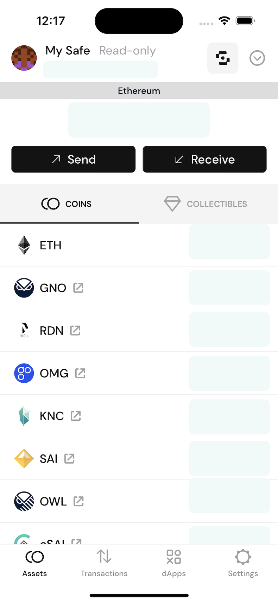
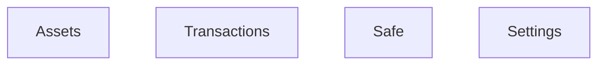
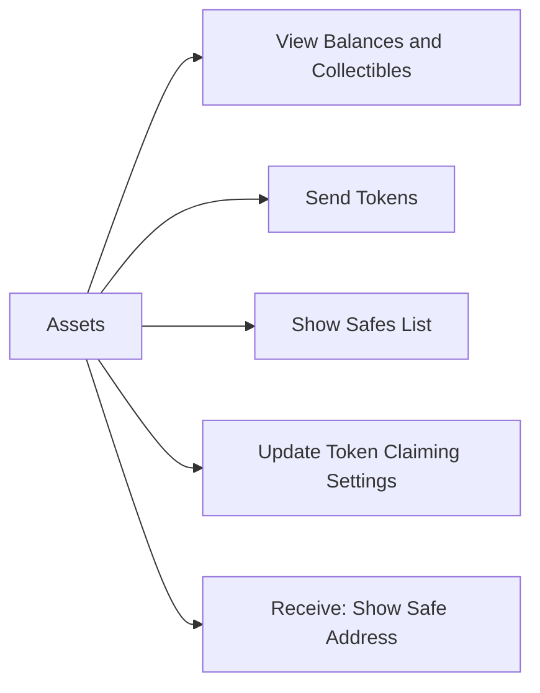
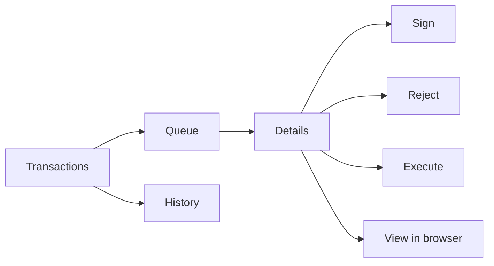
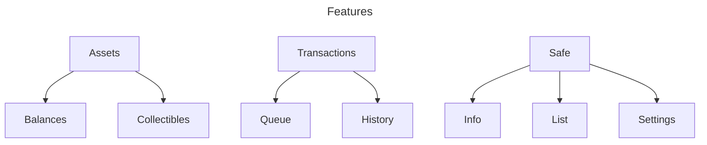
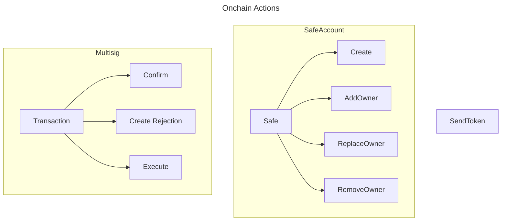
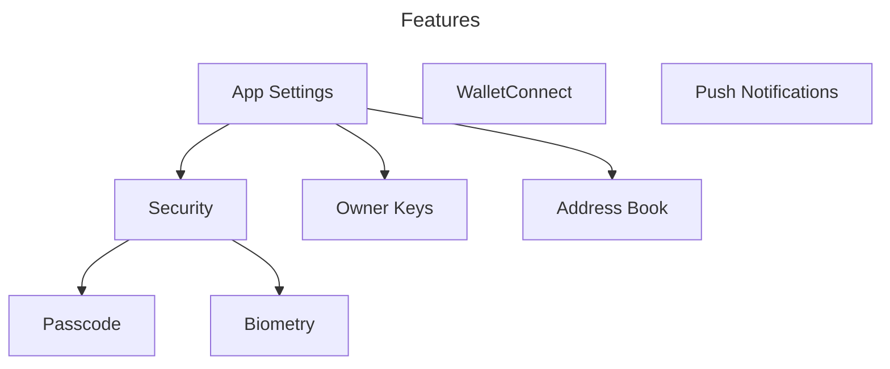
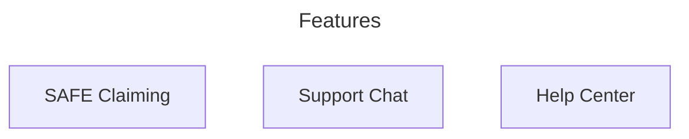
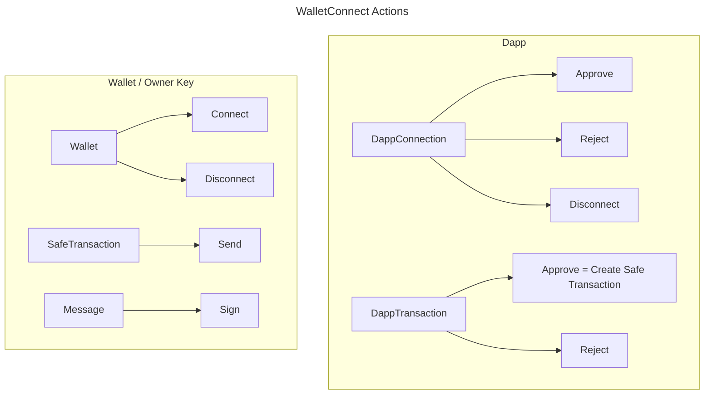

## Functional View

The app, yet simple, has more than one function. You can interpret diagrams below as a survey of the features.

- `Assets` shows a quick view of a safe's balances and relevant actions
- `Transactions` deals with lists of pending and past transactions
- `Dapps` shows current connections to browser apps
- `Settings` shows apps' and safe's settings and is a home to other app features

### Assets
Arrows in represent "contains" relationship

Assets area of the app loads safe's balances and is a place where user starts related interface flows.

### Transactions

Transactions area of the app is the place where user would view and act on the staged transactions or browse past transactions.
- `Queue` lists pending transactions. New transaction requests appear her.
    - `Details` include such information as the type of transaction and help user understand what this transaction is about, in detail.
    - `Sign` action starts wallet flow to authenticate transaction for sending to the blockchain.

The app allows to load or create Safe accounts and view their assets and transactions, as well as create and execute new transactions.

The supported transaction functions are in 3 areas: general transaction confirmation functionality, safe-related transactions that change multisig settings, and transactions to send out tokens.

Supporting functionality allows to set up a `Passcode` to restrict access to the app, add `Owner Keys` that would be used to interact with safe accounts and receive `Push Notifications` about Safe transactions.

`Address Book` allows for better readability of transaction data in the interface. 

Useres can use `Chat with us` feature implemented via Intercom to talk with a human.

`WalletConnect` is used to receive incoming transaction requests from the external apps (browser or native dapps).
It is also used to connect to the external wallets in order to access functions of private keys there: sign a message or send a transaction.
