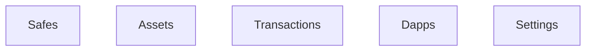
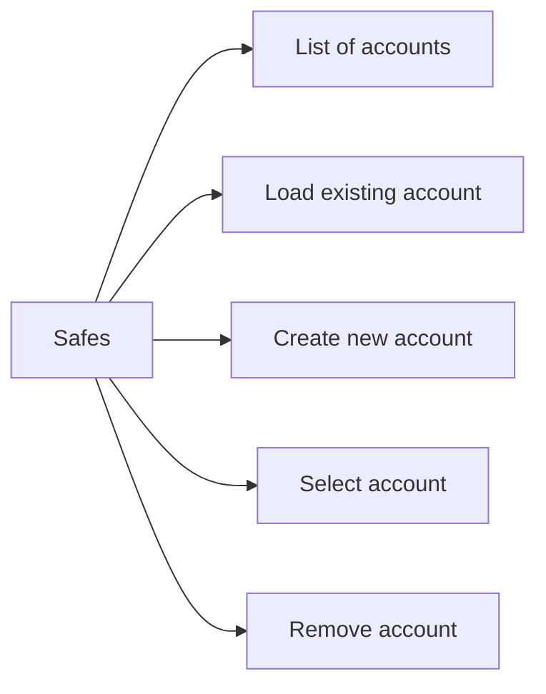
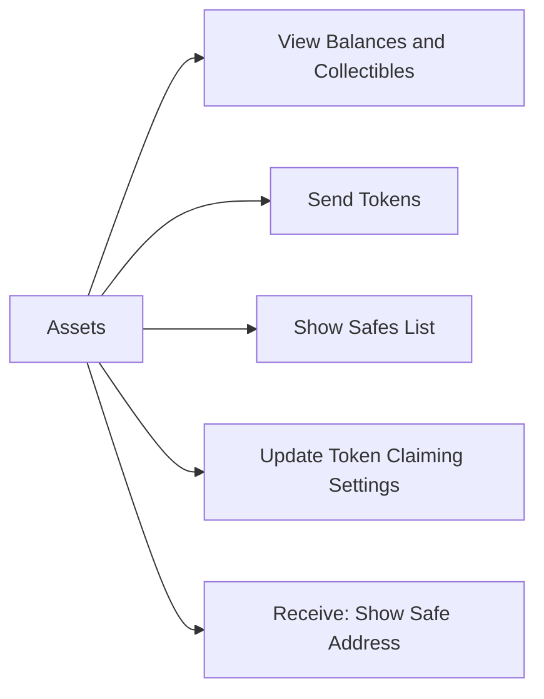
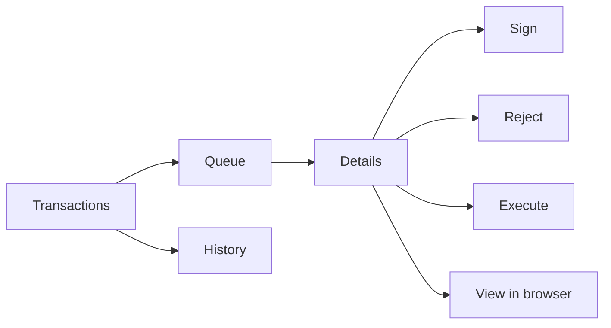
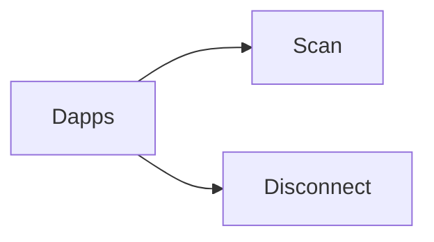
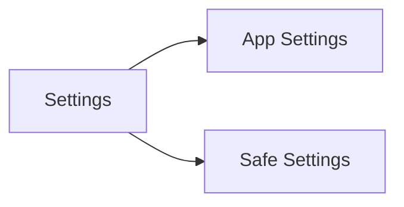
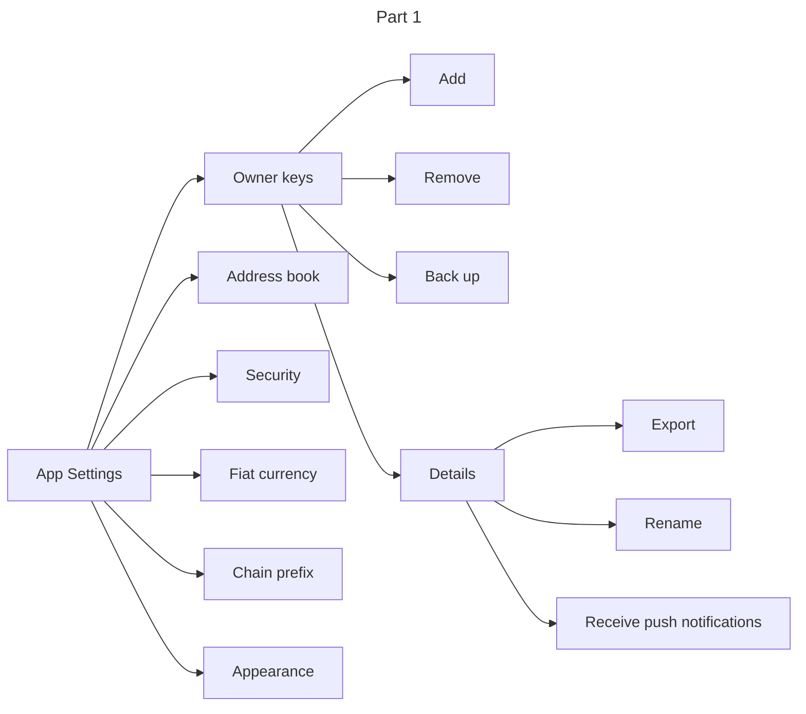
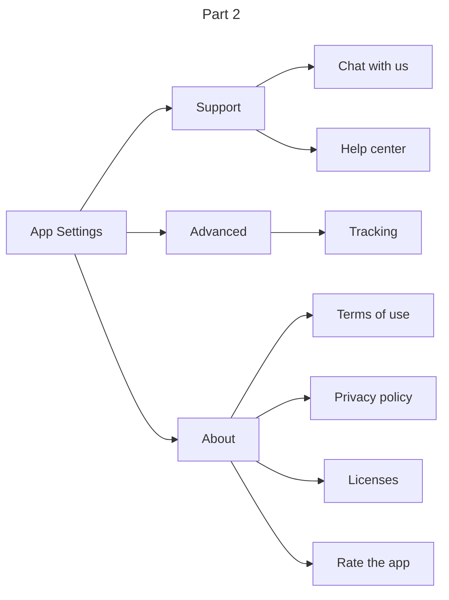
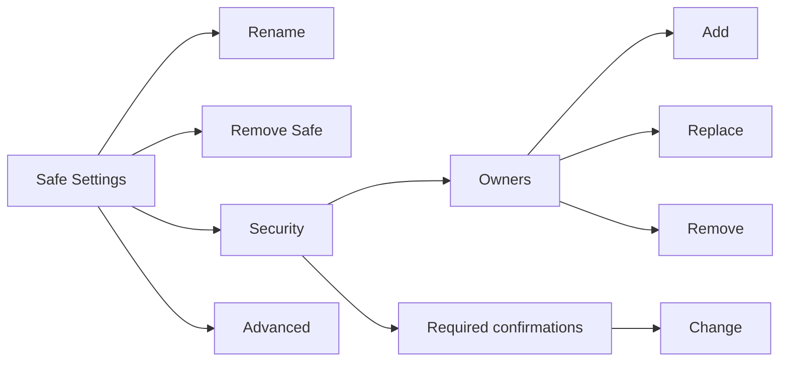

## Functional View

The app, yet simple, has more than one function. You can interpret diagrams below as a survey of the features.

- `Safes` shows list of added accounts
- `Assets` shows a quick view of a safe's balances and relevant actions
- `Transactions` deals with lists of pending and past transactions
- `Dapps` shows current connections to browser apps
- `Settings` shows apps' and safe's settings and is a home to other app features

### Safes

`Safes` list is accessible from every app tab and shows all accounts added to the app.

  - `Load existing account` allows to add existing safe to the app
  - `Create new account` opens safe creation form. For some networks, the creation is sponsored (such as Gnosis Chain), for others user must have an owner key added to the safe before creating an account
  - `Select account` will change the selected safe.
  - `Remove account` removes the safe from the list. The safe itself still exists but is removed from the app.

### Assets
Arrows in the diagram below represent "contains" relationship

Assets area of the app loads safe's balances and is a place where user starts related interface flows.

### Transactions

Transactions area of the app is the place where user would view and act on the staged transactions or browse past transactions.
- `Queue` lists pending transactions. New transaction requests appear her.
    - `Details` include such information as the type of transaction and help user understand what this transaction is about, in detail.
    - `Sign` action starts wallet flow to authenticate transaction for sending to the blockchain.
- `History` is a list of past transactions outgoing or incoming to the safe. Each transaction can be viewed in detail. 

### Dapps

The `Dapps` area holds a list of connections to external apps via Wallet Connect protocol.

  - `Scan` action brings up camera to scan a connection QR-code.
  - When connection is active, the swipe left gesture allows to `Disconnect`.

The apps connected to the safe send requests for sending transactions, which opens a separate transaction request screen. 

### Settings

`Settings` groups various utility functions and configurations.

  - `App Settings` contains configuration related to the app itself
  - `Safe Settings` contains detailed information about the selected safe.

#### App Settings

- `Owner keys` is a list of connected or imported keys that are used for transaction signing. 
    - `Add` calls a wizard to add a key. 
    - `Remove` deletes the key.
    - `Back up` starts backup flow to guide user with secret key back up process.
    - `Details` show more details about the key.
         - `Export` allows to export the imported or created key material.
         - `Rename` sets key's name.
         - `Receive push notifications` configures the app to receive requests to sign transactions with this key via push notifications.
- `Address book` is a list of contacts (address-name pairs). 
- `Security` deals with the pasccode and biometric protection.
- `Fiat currency` configures which currency the prices are shown.
- `Chain prefix` turns on or off the short chain name (network name) in front of addresses. Used to protect from the mistaken transfers to a wrong network. 
- `Appearance` sets light/dark or automatic interface appearance.

Continuing with the `App Settings`, it also includes:
- `Chat with us` opens the chat with support (via Intercom)
- `Help center` opens the help hub with common questions and answers in the form of help articles.
- `Tracking` turns off or on the app usage collection and crash reporting.
- `Terms of use` shows the terms and conditions
- `Privacy policy` shows current privacy policy document
- `Licenses` lists software licenses.
- `Rate the app` allows to leave feedback via rating in the app store

#### Safe Settings

`Safe Settings` shows selected safe's configuration values, such as its name, version, and allows to make changes to it if the owner is present in the owner keys.

  - `Rename` changes safe's name.
  - `Remove Safe` deletes the safe from the app.
  - `Security` shows safe's owner configuration.
    - `Add` calls a wizard to add new owner via onchain transaction.
    - `Replace` starts flow to replace existing owner with another one.
    - `Remove` starst flow to remove existing owner.
    - `Required confirmations` shows the threshold count of signatures required for confirming transactions. 
  - `Advanced` shows technical settings for the contract, such as addresses of guards and fallback handlers.

